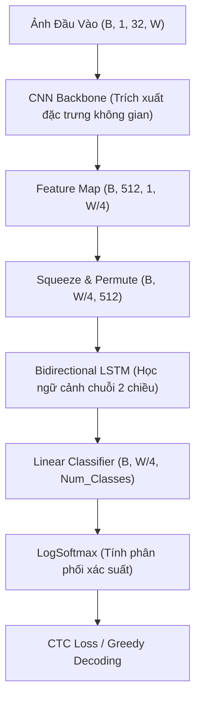

# Kiến Thức Hệ Thống & Thuật Ngữ Đặc Trưng - LamSonOCR

Tài liệu này hệ thống hóa các kiến thức cốt lõi, mô hình học máy, thuật toán giải mã và các cơ chế tối ưu hóa hiệu năng được áp dụng trong dự án **LamSonOCR**.

---

## 1. Kiến Trúc Mô Hình (CRNN + CTC)

Mô hình nhận diện chữ viết tay và dòng văn bản trong dự án sử dụng kiến trúc kết hợp **CNN + RNN + CTC** tiêu chuẩn cho bài toán OCR chuỗi (Sequence Recognition).

### CNN (Convolutional Neural Network)
*   **Giải nghĩa**: Mạng nơ-ron tích chập đóng vai trò bộ trích xuất đặc trưng (Feature Extractor) từ ảnh đầu vào.
*   **Hoạt động trong dự án**: Nhận ảnh xám kích thước $32 \times W$ (chiều cao cố định 32px, chiều rộng biến thiên). Trải qua 6 khối tích chập kết hợp `BatchNorm` và `ReLU`, CNN thu gọn thông tin không gian (Spatial Features) theo chiều cao xuống còn 1 pixel, đồng thời giảm chiều rộng đi 4 lần ($W' = W / 4$). Đầu ra là một chuỗi vector đặc trưng có kích thước $512$ kênh.

### BiLSTM (Bidirectional Long Short-Term Memory)
*   **Giải nghĩa**: Mạng nơ-ron hồi quy LSTM hai chiều hỗ trợ ghi nhớ thông tin ngữ cảnh chuỗi dài mà không bị mất mát gradient (vanishing gradient).
*   **Hoạt động trong dự án**: Tiếp nhận chuỗi vector đặc trưng từ CNN. Nhờ cơ chế chạy song song hai chiều (từ trái qua phải và từ phải qua trái), BiLSTM liên kết thông tin của các nét vẽ trước và sau của chữ viết. Đầu ra tại mỗi bước thời gian (timestep) kết hợp thông tin của cả hai hướng giúp tăng tính chính xác khi nhận diện các ký tự đứng liền kề.

---

## 2. Các Khái Niệm Toán Học & Đặc Trưng Trong CTC

**CTC (Connectionist Temporal Classification)** là thuật toán mấu chốt giúp huấn luyện mô hình OCR nhận diện chuỗi ký tự mà không cần căn chỉnh (alignment) vị trí chính xác của từng ký tự trên ảnh đầu vào.

### Timestep ($T$)
*   **Giải nghĩa**: Số lượng phân đoạn thời gian dọc theo trục ngang (chiều rộng) của ảnh được CNN trích xuất ra.
*   **Đặc trưng quan trọng**:
    *   Với cấu trúc downsampling của CNN hiện tại, $T = \text{Width} / 4$.
    *   **Quy tắc giới hạn**: Số lượng timestep $T$ luôn phải **lớn hơn hoặc bằng** độ dài chuỗi ký tự của nhãn thực tế ($L$). Nếu $T < L$, thuật toán CTC không thể tìm được đường căn chỉnh hợp lệ, dẫn tới việc hàm lỗi trả về giá trị vô hạn (`loss=inf`).

### CTC Blank Token (`<BLANK>`)
*   **Giải nghĩa**: Một ký tự rỗng đặc biệt (thường mang index 0) được định nghĩa riêng trong CTC.
*   **Vai trò**:
    *   **Ngăn cách các ký tự lặp**: Giúp phân biệt giữa việc vẽ một ký tự kéo dài (ví dụ: chữ `o` viết dài ra) và viết hai ký tự giống nhau liên tiếp (ví dụ: `oo` trong "look").
    *   **Lấp đầy khoảng trống**: Biểu diễn các phân đoạn ảnh không chứa nét chữ nào (khoảng trắng giữa các từ hoặc giữa các nét viết).

### Greedy Decoding (Giải mã tham lam)
*   **Giải nghĩa**: Thuật toán giải mã nhanh nhất từ phân phối xác suất đầu ra của mô hình tại mỗi timestep.
*   **Thuật toán thực hiện**:
    1.  Tại mỗi timestep $t \in [1, T]$, chọn ký tự có xác suất cao nhất.
    2.  Hợp nhất các ký tự giống nhau đứng liên tiếp (Collapse repeats).
    3.  Loại bỏ tất cả các token `<BLANK>`.
    *   *Ví dụ*: Chuỗi ban đầu `[a, a, <blank>, a, b, b]` $\rightarrow$ Hợp nhất: `[a, <blank>, a, b]` $\rightarrow$ Loại bỏ blank: `[a, a, b]` (kết quả "aab").

---

## 3. Các Cơ Chế Tối Ưu Hóa Hiệu Năng Huấn Luyện (Performance)

Để tăng tốc độ huấn luyện trên hạ tầng đám mây (GPU RTX 3090 của RunPod) và loại bỏ hiện tượng nghẽn cổ chai (bottleneck) nạp dữ liệu, các cơ chế sau đã được tích hợp:

### AMP (Automatic Mixed Precision - Độ phân cực hỗn hợp)
*   **Giải nghĩa**: Kỹ thuật tự động chuyển đổi kiểu dữ liệu tính toán giữa Float16 (nửa độ chính xác) và Float32 (độ chính xác đơn).
*   **Tác dụng**: Giúp tăng tốc độ tính toán của nhân Tensor Cores trên GPU gấp 2-3 lần và giảm 50% dung lượng VRAM.
*   **Lưu ý kỹ thuật**: Vì CTC Loss cực kỳ nhạy cảm với sai số dấu phẩy động, đầu ra của mô hình được ép kiểu ngược về Float32 (`log_probs.float()`) trước khi tính loss nhằm ngăn chặn hoàn toàn lỗi `nan` loss.

### `torch.compile()`
*   **Giải nghĩa**: Tính năng biên dịch Just-In-Time (JIT) được giới thiệu từ PyTorch 2.0.
*   **Tác dụng**: Gom các lớp tính toán rời rạc (như Conv $\rightarrow$ BatchNorm $\rightarrow$ ReLU) thành một kernel CUDA hợp nhất duy nhất chạy trực tiếp trên GPU. Nó loại bỏ hoàn toàn chi phí CPU-GPU dispatch overhead (thời gian CPU chờ đợi và lập lịch lệnh gửi sang GPU), tối ưu hóa triệt để hiệu năng với mô hình nhẹ như CRNN.

### Persistent Workers & Prefetching
*   **Giải nghĩa**: Cơ chế duy trì luồng và tải trước dữ liệu của `DataLoader`.
*   **Tác dụng**:
    *   `persistent_workers=True` giúp giữ các tiến trình con đọc đĩa luôn hoạt động giữa các epoch, loại bỏ độ trễ khởi tạo lại tiến trình.
    *   `prefetch_factor=4` cho phép mỗi worker đọc trước 4 batch dữ liệu vào RAM, đảm bảo GPU luôn có sẵn dữ liệu để tính toán, nâng cao mức sử dụng GPU (GPU Utilization).

---

## 4. Cơ Chế Lập Bản Đồ Ký Tự (Dynamic Charset)

### Dynamic Self-contained Charset (Bộ ký tự động tự chứa)
*   **Giải nghĩa**: Thay vì hardcode cứng danh sách ký tự (dẫn đến lỗi khi tập dữ liệu huấn luyện thay đổi hoặc bổ sung thêm Kanji mới từ ETL), bộ ký tự sẽ được tạo tự động.
*   **Cách thức hoạt động**:
    1.  **Quét động**: Đọc qua file `labels.csv` khi bắt đầu huấn luyện để tìm ra tất cả các ký tự độc bản.
    2.  **Đóng gói**: Danh sách ký tự được lưu trữ trực tiếp bên trong file checkpoint `best_model.pt` (`vocab`).
    3.  **Tự phục hồi**: Khi chạy suy luận (Inference), mô hình tự động khôi phục chính xác bộ giải mã dựa trên danh sách `vocab` đính kèm trong checkpoint mà không phụ thuộc vào file code cấu hình bên ngoài.

### Polarity Alignment (Đồng nhất độ phân cực ảnh)
*   **Giải nghĩa**: Đưa tất cả ảnh dữ liệu về cùng một kiểu biểu diễn màu sắc nền và chữ viết (Nền trắng 255, chữ đen 0).
*   **Tác dụng**: Ảnh sinh tự động (Synthetic) và ảnh trích xuất từ ETL (ETL1-9) có độ tương phản ngược nhau (đen trên trắng và trắng trên đen). Việc đồng nhất độ phân cực giúp mô hình nhanh chóng hội tụ và tránh hiện tượng triệt tiêu gradient.

---

## 5. Phân Tích Sự Hội Tụ Của Kiến Trúc Zero-Extraction

Trong quá trình cải tiến hệ thống nạp dữ liệu, việc chuyển đổi từ trích xuất ảnh PNG vật lý sang đọc trực tiếp file nhị phân qua RAM (**Zero-Extraction**) đã đem lại sự sụt giảm loss mạnh mẽ ngay từ epoch đầu tiên (giảm từ **8** xuống thẳng **~2**):

### 1. Cơ chế lọc nhãn rỗng (Label Filtering)
*   **Vấn đề cũ**: Khi trích xuất ảnh thô ra đĩa, các ký tự không nằm trong bộ từ vựng (ví dụ: các chữ Kanji hiếm trong tập ETL9G) vẫn được lưu thành ảnh và gán nhãn rỗng `[]` khi encode. Mô hình bị buộc phải học cách dự đoán nhãn rỗng cho những nét chữ thực tế, tạo ra các gradient nhiễu loạn nghiêm trọng làm tăng loss tổng thể (đạt mức ~8).
*   **Giải pháp mới**: Khi quét mục lục file nhị phân (`_build_index`), hệ thống kiểm tra trước `len(self.charset.encode(char)) > 0`. Những ký tự ngoài bộ từ vựng sẽ bị loại bỏ khỏi luồng huấn luyện ngay lập tức thay vì đưa nhãn rỗng vào mô hình. Gradient trở nên cực kỳ sạch và tập trung.

### 2. Đồng bộ hóa dải chuẩn hóa ảnh (Consistent Normalization)
*   **Vấn đề cũ**: Ảnh tổng hợp (Synthetic) được chuẩn hóa về dải `[0, 1]` thông qua `torchvision.transforms.functional.to_tensor()`. Trong khi đó, ảnh đọc thô từ ETL lại bị chuẩn hóa về dải `[-1, 1]` do khác biệt trong thuật toán cũ. Sự không nhất quán này khiến các tham số trọng số trong mạng neuron bị xung đột liên tục.
*   **Giải pháp mới**: Đồng bộ toàn bộ dải chuẩn hóa đầu vào về `[0, 1]`. Phân phối đầu vào của mô hình trở nên đồng nhất, giúp mô hình hội tụ vô cùng mượt mà.

### 3. Ảnh hưởng của kích thước Batch lớn (Batch Size 1024)
*   Kích thước Batch lớn kết hợp với tối ưu GPU của `torch.compile` giúp gradient của mỗi bước cập nhật cực kỳ ổn định, giảm thiểu dao động nhiễu của các batch nhỏ trước đó. Mô hình đạt tốc độ hội tụ tối đa chỉ sau vài trăm batch đầu tiên.
